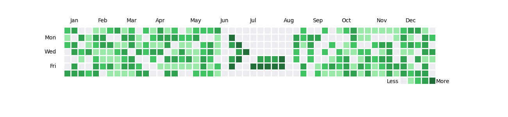

# GitHub Contribution Graph Editor

Design and upload a unique Github contribution graph that makes your Github profile stand out.



## Features

- **Interactive Web App**: Simple Streamlit interface allows you to generate unique patterns
- **GitHub Integration**: Automatically upload commit designs to your repository
- **Profile enhancement**: Improve visual appeal and have fun with your Github profile

## Installation

### Prerequisites

- Python 3.12 or higher
- A GitHub account and personal access token
- [A new GitHub repository for uploading commits](https://github.com/new)

### GitHub Personal Access Token

You'll need a GitHub Personal Access Token with `repo` permissions. Create one at [GitHub Settings > Developer settings > Personal access tokens](https://github.com/settings/tokens).

### Setup

1. Clone the repository:
   ```bash
   git clone https://github.com/your-username/github-contribution-graph-editor.git
   cd github-contribution-graph-editor
   ```

2. Install dependencies:
   ```bash
   pip install -e .
   ```

   Or using uv (recommended):
   ```bash
   uv sync
   ```

## Usage

#### Configuration for Streamlit App

Create a `.streamlit/secrets.toml` file in the project root:

```toml
GITHUB_USERNAME = "your-github-username"
GITHUB_EMAIL = "your-email@example.com"
GITHUB_TOKEN = "your-personal-access-token"
REPO_URL = "https://github.com/your-username/your-repo.git"
```

### Interactive Web App

Run the Streamlit app for an interactive experience:

```bash
streamlit run src/app.py
```

This will open a web interface available at `http://localhost:8501` where you can:
- Manually edit the contribution grid (7x52 cells representing days)
- Use "Random Fill" to generate random patterns
- Preview the contribution graph
- Upload commits to GitHub

## Contributors
Contributions of any kind welcome. See [contributing guide](DEVELOPMENT.md).

## License

This project is licensed under the MIT License - see the [LICENSE](LICENSE) file for details.

## Disclaimer

This tool creates commits on your GitHub repository. Use responsibly and be aware that excessive automated commits may violate GitHub's terms of service. The commits created are empty (no actual code changes) and serve only to visualize patterns on your contribution graph.
